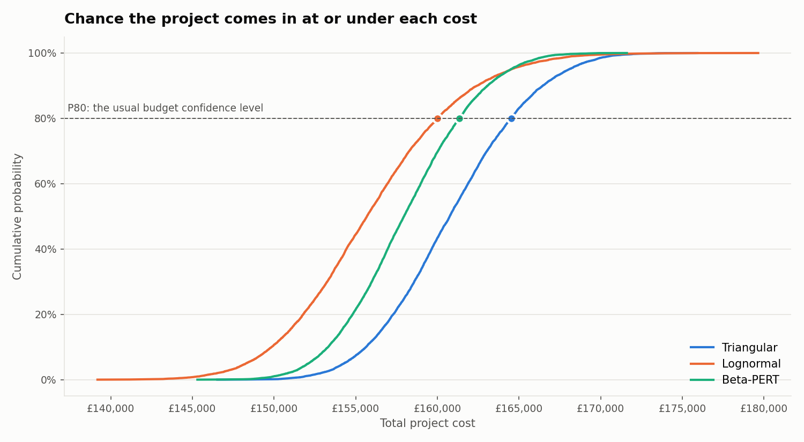
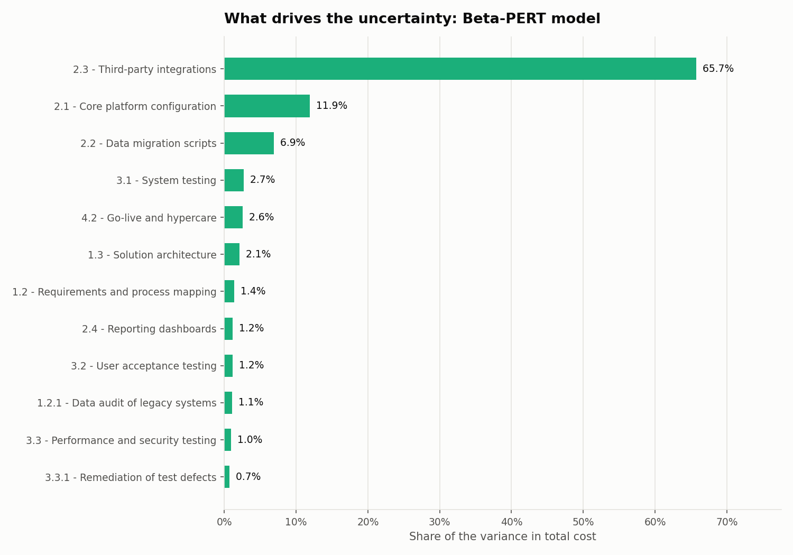
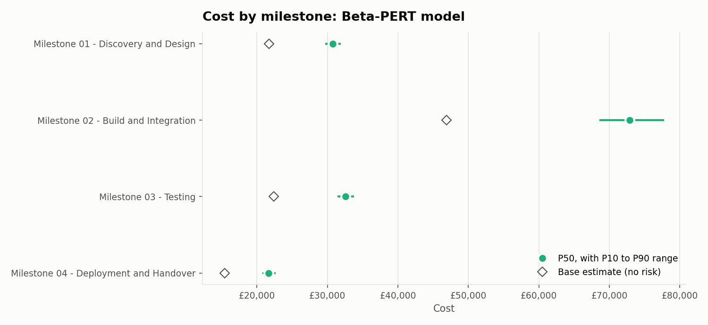

# Monte Carlo Cost-Risk Model for Project Estimates

[](https://colab.research.google.com/github/Divyaprakash-SM/Monte-Carlo-Simulation/blob/main/notebooks/Monte_Carlo_Walkthrough.ipynb)

A single cost estimate hides its own uncertainty. This model takes a project's Work Breakdown Structure (WBS), simulates it 10,000 times, and turns one number into a range with a confidence level attached: *"there is an 80% chance this project costs £161k or less."*

It was built for my MSc dissertation at the University of Southampton, *Monte Carlo Simulation for Increased Risk, Cost and Uncertainty Considerations*, in collaboration with Synoptix, a UK engineering company, to give fixed-price bids quantified uncertainty ranges instead of judgement-based pricing. It has been developed further since.



## What it tells you

| Question | Output |
|---|---|
| What is the realistic cost range? | P10, P50, P80 and P90 for the whole project |
| How much contingency should the budget carry? | The gap between the base estimate and the P80 (or P50 / P90) cost |
| Which tasks drive the risk? | Each task's share of the variance in total cost (tornado chart) |
| Which milestone carries the most exposure? | P10 to P90 range for every milestone |
| Does the choice of distribution matter? | Triangular, Lognormal and Beta-PERT run side by side on the same random numbers |

**Reading the percentiles:** P50 is a coin flip: half the simulated projects came in under it. P80 is the level most organisations budget to: 8 in 10 came in under it. P90 is a cautious ceiling.

## Quick start

**In the browser (no install):** click *Open in Colab* above and run the cells.

**On your computer:**

```bash
git clone https://github.com/Divyaprakash-SM/Monte-Carlo-Simulation.git
cd Monte-Carlo-Simulation
pip install -r requirements.txt

python run_model.py                          # runs the sample project with all three models
python run_model.py path/to/your_wbs.xlsx    # runs your own file
```

Each run prints a summary and saves charts plus an Excel report to `outputs/`:

```
Base estimate (sum of task costs): £106,400
Risk-loaded estimate:              £155,260

     Model      Mean       P10       P50       P80       P90  Std Dev  Contingency at P80 (%)
Triangular 160,906.2 155,633.9 160,755.6 164,533.8 166,455.4  4,157.3                    54.6
 Lognormal 155,954.0 149,851.3 155,687.4 160,014.0 162,441.1  4,936.7                    50.4
 Beta-PERT 158,083.6 153,312.1 157,953.5 161,344.2 163,081.0  3,748.2                    51.6
```

### Options

| Option | Default | What it does |
|---|---|---|
| `--dist` | `all` | `triangular`, `lognormal`, `pert`, or `all` to compare them |
| `--sims` | `10000` | Number of simulations |
| `--low`, `--high` | `0.90`, `1.20` | Optimistic and pessimistic factors, used when a task has no range of its own |
| `--risk` | `loaded` | How risk multipliers are used: `loaded`, `event` or `none` (see below) |
| `--correlation` | `0` | Shared drift between tasks, from 0 (independent) to 0.95 |
| `--seed` | `42` | Makes results repeatable; `-1` for a fresh random run |
| `--currency` | `£` | Symbol used on charts |
| `--pick` | | Choose the input file in a dialog instead of typing a path |

## Input format

An Excel (`.xlsx`) or CSV file. Column order does not matter and the header row does not have to be row 1; columns are found by name. `data/sample_wbs.xlsx` is a working example.

| Column | Required | Notes |
|---|---|---|
| `WBS Code` | Recommended | `1`, `1.1`, `1.2.1` ... Store it as text in Excel so `1.10` is not read as `1.1` |
| `Task` | Yes | Task name |
| `Cost` | Yes | Most-likely cost |
| `Optimistic Cost` | No | Overrides the default low factor for that task |
| `Pessimistic cost` | No | Overrides the default high factor for that task |
| `Risk - Likelihood` | No | 1 to 6 scale; needed for `--risk event` |
| `Risk % multiplier` | No | e.g. `0.4` = the risk adds 40% to that task. Blank means no risk |

**Milestone and sub-total rows are detected automatically.** A row whose cost equals the total of the tasks beneath it is treated as a sub-total and left out of the simulation, so no cost is counted twice. A parent row whose cost does *not* add up (a task with its own cost that also has sub-tasks) is kept as a task, and the model prints a note so you can confirm it.

## How the model works

1. **Three-point estimate.** Each task gets an optimistic, most-likely and pessimistic cost, either from the sheet or from the default 90% / 100% / 120% range.
2. **Risk.** The risk multiplier is applied in one of three ways:
   * `loaded` *(default, the dissertation method)*: every task is priced up by its multiplier before simulation. A task with a 0.4 multiplier is treated as costing 40% more, in every simulation.
   * `event`: each risk either happens or it does not. The chance is likelihood / 6, and if it happens the task costs its multiplier more. This gives a wider, right-skewed range that reflects risks as events rather than a blanket uplift.
   * `none`: estimate uncertainty only.
3. **Sampling.** Each task's cost is drawn from the chosen distribution:
   * **Triangular**: straight lines between the three points. Simple and transparent; gives the most weight to the extremes.
   * **Beta-PERT**: a smooth curve that weights the most-likely value four times as heavily as the extremes. The usual choice in project management.
   * **Lognormal**: median at the most-likely cost, with the optimistic-to-pessimistic range treated as a 95% band. Can run past the pessimistic value, reflecting the long overrun tail seen on real projects.
4. **Correlation (optional).** By default tasks vary independently, so overruns and underruns cancel out and the total looks narrower than real projects behave. `--correlation 0.3` makes tasks drift together, as they do when one delay knocks on to others. On the sample project it widens the P10 to P90 range by about 75%.
5. **Totals and analysis.** Task costs are added up in each simulation to give 10,000 possible project totals, then summarised by project, by milestone and by task.

The three distributions share the same random numbers, so differences between them come from the distribution alone, not from sampling noise.

## Outputs

| File | Contents |
|---|---|
| `s_curve.png` | Cumulative probability for each model, with P80 marked |
| `<model>_distribution.png` | Histogram of total cost with P10, P50 and P90 |
| `<model>_tornado.png` | The tasks that drive the most uncertainty |
| `<model>_milestones.png` | P50 and P10 to P90 range per milestone, against the base estimate |
| `results.xlsx` | Project summary and contingency, milestone summaries, sensitivity, the three-point inputs, and every assumption used |





The tornado chart ranks tasks by their **share of the variance** in total cost: each task's covariance with the total divided by the total's variance. The shares add up to 100%, so a task at 40% causes 40% of the spread in the final cost. A large task is not always a risky one; this chart separates the two.

## Project structure

```
├── run_model.py                  command-line entry point
├── montecarlo/
│   ├── loader.py                 reads the WBS, finds headers, removes sub-total rows
│   ├── model.py                  three-point estimates, distributions, risk, correlation
│   ├── analysis.py               summaries, contingency, milestone roll-up, sensitivity
│   ├── charts.py                 the four charts
│   └── report.py                 Excel export
├── notebooks/
│   └── Monte_Carlo_Walkthrough.ipynb
├── data/
│   └── sample_wbs.xlsx           fictional sample project
├── docs/images/                  charts used in this README
└── tests/test_model.py           automated checks
```

## Tests

```bash
pip install pytest
python -m pytest -q
```

The tests check that sub-total rows are never double counted, that the simulated means match the textbook formulas for Triangular ((a + m + b) / 3) and Beta-PERT ((a + 4m + b) / 6), that samples stay within their bounds, that results repeat with the same seed, that correlation widens the range, and that the variance shares add up to 100%.

## Changes from the dissertation version

* **Fixed double counting.** The earlier scripts in this repository summed the milestone sub-total rows as well as the tasks beneath them, which roughly doubled the total. The loader now detects and removes sub-totals.
* One engine for all three distributions instead of three near-identical scripts.
* Header row and columns found by name, so the input layout can vary.
* Optimistic and pessimistic costs can be set per task.
* New `event` risk mode and optional correlation between tasks.
* Variance-based sensitivity replaces the earlier mean-contribution chart.
* S-curve, milestone chart, contingency figures and a single Excel report.
* Automated tests, a runnable sample project, and a Colab notebook.

## Author

**Divyaprakash S M**, MSc Business Analytics and Management Science, University of Southampton. PMP and PRINCE2 Agile certified.
Dissertation supervised by Dr James Stallwood. Industry collaboration with Synoptix.

The sample data in this repository is fictional. The original project data remains with Synoptix and is not included.
