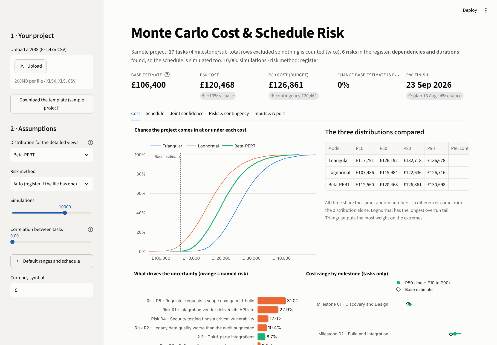
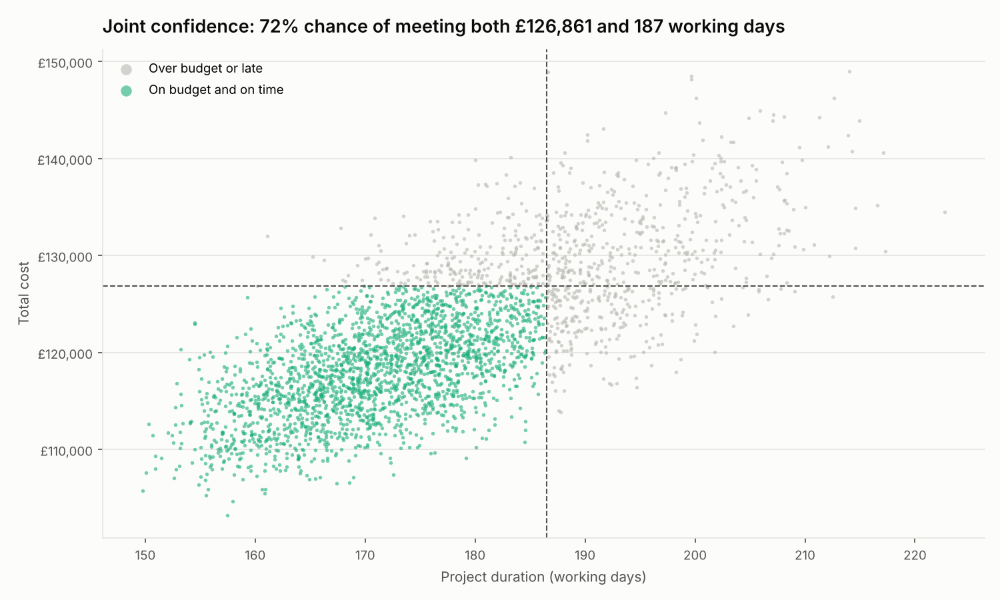
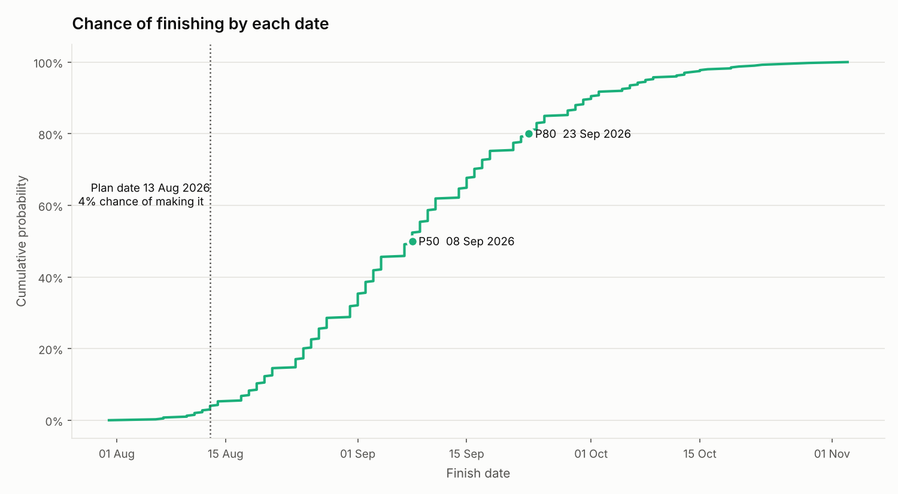
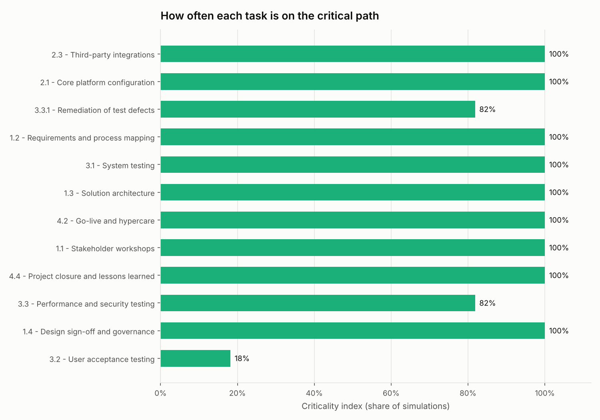
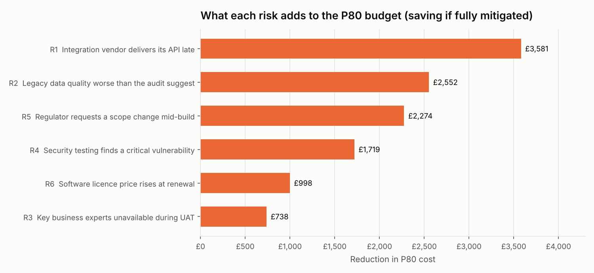
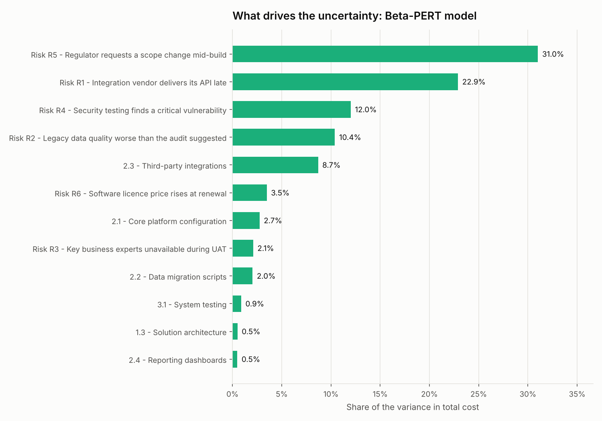
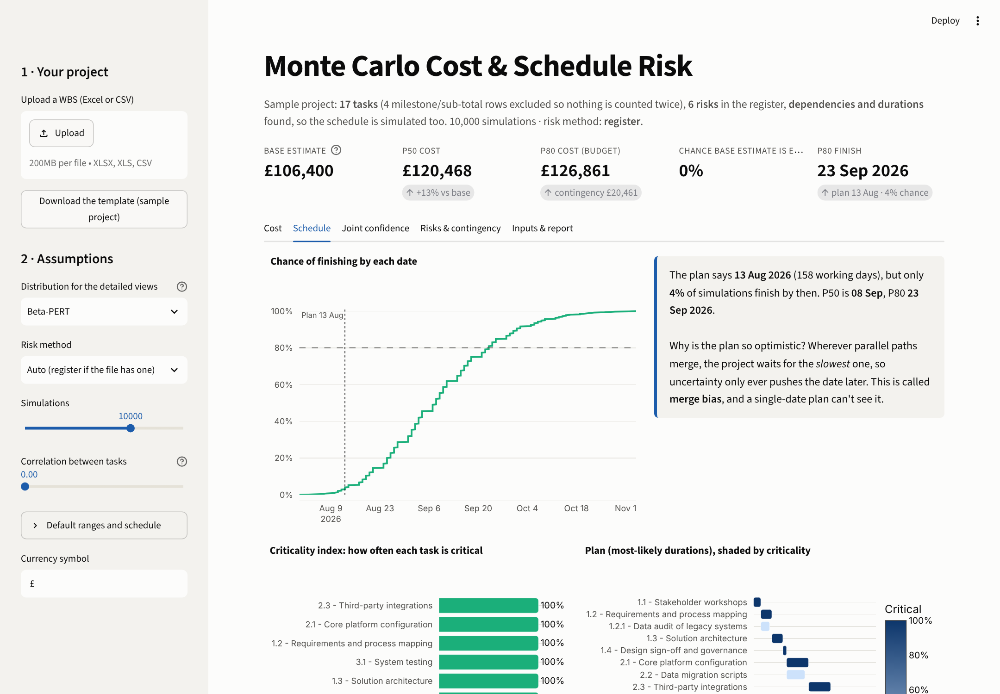
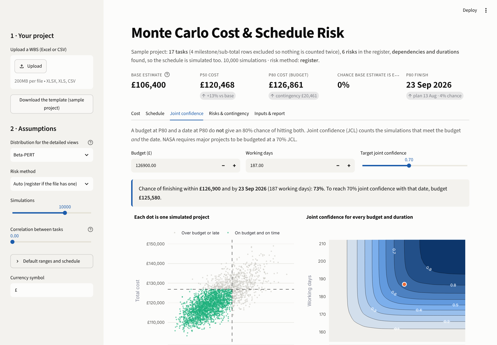

# Monte Carlo Cost & Schedule Risk Model

**▶ Live app: [montecarlo-dsmk.streamlit.app](https://montecarlo-dsmk.streamlit.app)** · no install needed

[](https://colab.research.google.com/github/Divyaprakash-SM/Monte-Carlo-Simulation/blob/main/notebooks/Monte_Carlo_Walkthrough.ipynb)

A single cost estimate and a single finish date hide their own uncertainty. This model takes a project's Work Breakdown Structure (WBS), simulates it 10,000 times, and turns each single number into a range with a confidence level: *"there is an 80% chance this project costs £126,861 or less and finishes by 23 September."*

It started as my MSc dissertation at the University of Southampton, *Monte Carlo Simulation for Increased Risk, Cost and Uncertainty Considerations*, built in collaboration with Synoptix, a UK engineering company. The aim was to give fixed-price bids quantified uncertainty ranges instead of judgement-based pricing. Version 3 extends it from cost alone to **cost, schedule and named risks together**, with a web app anyone can use without installing anything.



## What it tells you

| Question | Output |
|---|---|
| What is the realistic cost range? | P10, P50, P80 and P90 for the whole project, under three distributions |
| When will it really finish? | Finish-date range from the dependency network, using the Critical Path Method on every run |
| Which tasks control the end date? | **Criticality index**: how often each task is on the critical path |
| What are the odds of hitting budget *and* date? | **Joint confidence level (JCL)**: the measure NASA requires for major projects |
| How much contingency, and what for? | Contingency split into *estimate uncertainty* and *named risks* |
| Who should hold the contingency? | Contingency **allocated to milestones**, adding up exactly to the total |
| Which risks are worth mitigating? | How much each risk adds to the P80 budget and P80 finish |
| Which tasks drive cost uncertainty? | Each task's (and each risk's) share of the variance in total cost |

**Reading the percentiles:** P50 is a coin flip: half the simulated projects came in under it. P80 is the level most organisations budget to: 8 in 10 came in under it. P90 is a cautious ceiling.

## What the sample project shows

The fictional 17-task IT project (base estimate £106,400, planned at 158 working days) makes four points that a single-point plan cannot:

1. **The plan date has a 4% chance.** Wherever parallel paths merge, the project waits for the slowest one, so uncertainty only ever pushes the date later (*merge bias*). The realistic P80 finish is 23 Sep, six weeks after the planned 13 Aug.
2. **P80 cost plus P80 date is not 80% confidence.** Meeting both together has a 72% chance, because cost and time pull in the same direction but not perfectly.
3. **Contingency has two jobs.** Of the £20,461 P80 contingency, £8,048 covers estimating uncertainty and £12,413 covers the six named risks.
4. **Expected cost is the wrong way to rank risks.** A risk on a task with float can cost money without delaying anything. Legacy data quality (R2) adds £2,552 to the P80 budget and **zero days** to the P80 date, while the late integration API (R1) adds both.



## Quick start

**In the browser, no install:** run the web app (see *Deploy* below), or click *Open in Colab* above and run the cells.

**On your computer:**

```bash
git clone https://github.com/Divyaprakash-SM/Monte-Carlo-Simulation.git
cd Monte-Carlo-Simulation
pip install -r requirements.txt

streamlit run app.py                         # interactive web app: upload your WBS, explore every result
python run_model.py                          # command line: sample project, all three models
python run_model.py path/to/your_wbs.xlsx    # command line: your own file
```

Each command-line run prints a summary and saves charts plus an Excel report to `outputs/`:

```
Risk mode: register   Correlation: 0.0   Simulations: 10,000   Schedule: yes
Base estimate (sum of task costs): £106,400

     Model      Mean       P10       P50       P80       P90  Std Dev  Contingency at P80 (%)
Triangular 126,830.0 117,790.8 126,192.4 132,718.2 136,678.3  7,337.8                    24.7
 Lognormal 116,670.0 107,485.9 115,984.5 122,636.3 126,716.4  7,466.2                    15.3
 Beta-PERT 121,184.1 112,559.8 120,468.4 126,861.0 130,698.3  7,073.7                    19.2

Schedule (Beta-PERT): plan 158 working days (finish 13 Aug 2026, 4% chance of making it)
  P50 175 days -> 08 Sep 2026    P80 187 days -> 23 Sep 2026
  Joint confidence of P80 cost and P80 date together: 72%
  Budget for a 70% joint confidence with the P80 date: £125,811

P80 contingency £20,461: estimate uncertainty £8,048, named risks £12,413
```

### Command-line options

| Option | Default | What it does |
|---|---|---|
| `--dist` | `all` | `triangular`, `lognormal`, `pert`, or `all` to compare them |
| `--sims` | `10000` | Number of simulations |
| `--low`, `--high` | `0.90`, `1.20` | Optimistic and pessimistic cost factors, used when a task has no range of its own |
| `--risk` | `auto` | `register`, `loaded`, `event` or `none` (see below). `auto` uses the risk register if the file has one |
| `--correlation` | `0` | Shared drift between tasks, from 0 (independent) to 0.95 |
| `--start` | `2026-01-05` | Project start date, for finish dates (working days, Mon–Fri) |
| `--jcl` | `0.70` | Target joint confidence level |
| `--seed` | `42` | Makes results repeatable; `-1` for a fresh random run |
| `--currency` | `£` | Symbol used on charts |
| `--pick` | | Choose the input file in a dialog instead of typing a path |

## Input format

An Excel (`.xlsx`) or CSV file. Column order does not matter and the header row does not have to be row 1; columns are found by name. `data/sample_wbs.xlsx` is a working template. Every column marked *No* can be left out: the model does what it can with what it gets.

**WBS sheet**

| Column | Required | Notes |
|---|---|---|
| `WBS Code` | Recommended | `1`, `1.1`, `1.2.1` ... Store it as text in Excel so `1.10` is not read as `1.1` |
| `Task` | Yes | Task name |
| `Cost` | Yes | Most-likely cost |
| `Optimistic Cost`, `Pessimistic cost` | No | Override the default cost range for that task |
| `Risk - Likelihood`, `Risk % multiplier` | No | Per-task risk, used by the `loaded` and `event` methods |
| `Duration (days)` | No | Most-likely working days. Adding it switches on schedule analysis |
| `Optimistic Duration`, `Pessimistic Duration` | No | Override the default duration range (90% to 135%) |
| `Predecessors` | No | WBS codes this task must wait for, e.g. `1.3, 1.2.1`. A milestone code such as `2` means *after every task under 2* |
| `Time-dependent %` | No | Share of the task's cost paid by the day (people, equipment). If the task runs long, this part costs more. Default 50% |

**Risk Register sheet** (optional)

| Column | Notes |
|---|---|
| `Risk ID`, `Risk`, `Owner` | Identification |
| `Probability (%)` | Chance the risk happens, e.g. `40` (or `0.4`) |
| `Cost impact min / most likely / max` | Added to the total if the risk happens |
| `Schedule impact min / most likely / max (days)` | Added to the affected task's duration if it happens |
| `Affected task` | WBS code of the task the delay lands on. Blank = a cost-only risk |

**Milestone and sub-total rows are detected automatically.** A row whose cost equals the total of the tasks beneath it is treated as a sub-total and left out, so no cost is counted twice. A parent row whose cost does *not* add up is kept as a task, and the model prints a note so you can confirm it.

## How the model works

1. **Three-point estimates.** Each task gets an optimistic, most-likely and pessimistic cost (and duration), from the sheet or from the default ranges.
2. **Sampling.** Each value is drawn from the chosen distribution:
   * **Triangular**: straight lines between the three points. Simple and transparent; gives the most weight to the extremes.
   * **Beta-PERT**: a smooth curve weighting the most-likely value four times as heavily as the extremes. The usual choice in project management.
   * **Lognormal**: median at the most-likely value, with the range treated as a 95% band. It has the longest overrun tail.

   All three share the same random numbers, so differences between them come from the distribution alone.
3. **Risk.** Four methods:
   * `register` *(default when the file has a register)*: each named risk happens or not by its probability, adding a cost and a delay to the task it affects. This is the standard quantitative risk analysis approach.
   * `loaded` *(the dissertation method)*: every task is priced up by its risk multiplier before simulation, as if every risk were certain. On the sample project this gives a P80 of £167,521, compared with £126,861 from the register. Treating every risk as certain over-provisions by about £40k.
   * `event`: per-task risks happen with chance likelihood / 6.
   * `none`: estimate uncertainty only.
4. **Schedule.** If durations exist, the **Critical Path Method** runs on every simulation: a forward pass for the finish, a backward pass for float. Tasks with zero float are critical in that run. Across all runs this gives the finish-date range, each task's criticality index, and its *cruciality* (criticality × correlation with the finish date): where to focus schedule management.
5. **Cost and time linked.** The time-dependent share of each task's cost scales with its simulated duration, so overruns in time show up in cost. That is why cost and finish date are correlated in the joint confidence chart.
6. **Correlation (optional).** By default tasks vary independently, which understates real-world spread. `--correlation 0.3` makes them drift together. On the sample it widens the P10–P90 cost range by about 75% from estimate uncertainty alone, and by about 23% once the risk register is in play (the risk events already add spread of their own).
7. **Contingency.**
   * *Split:* the P80 is computed with and without the register, which separates estimate uncertainty from named risks.
   * *Allocation:* each milestone gets its expected overrun plus its share of the variance × (P80 − mean). The parts add up exactly to the total.
   * *Risk ranking:* each risk is removed in turn and the P80 cost and date recomputed.

Everything is vectorised with NumPy: one integrated run of 10,000 simulations, including 10,000 critical-path calculations, takes about a second.





## Outputs

| File | Contents |
|---|---|
| `s_curve.png` | Cumulative probability of cost for each model, with P80 marked |
| `<model>_distribution.png` | Histogram of total cost with P10, P50 and P90 |
| `<model>_tornado.png` | The tasks *and named risks* that drive cost uncertainty |
| `<model>_milestones.png` | P50 and P10–P90 range per milestone, against the base estimate |
| `finish_dates.png` | Chance of finishing by each date, with the plan date and its odds |
| `criticality.png` | How often each task is on the critical path |
| `joint_confidence.png` | Every simulated project as a dot: cost against duration, with the JCL |
| `risk_ranking.png` | How much each risk adds to the P80 budget |
| `results.xlsx` | Project summary, milestones, sensitivity, three-point inputs, schedule, contingency allocation, risk ranking and every assumption |



The cost tornado ranks by **share of the variance**: each item's covariance with the total divided by the total's variance. The shares add up to 100%. A large task is not always a risky one, and this chart separates the two.



## The web app

`streamlit run app.py` opens five tabs: **Cost**, **Schedule**, **Joint confidence**, **Risks & contingency** and **Inputs & report**. Upload your own WBS (or download the template), change any assumption in the sidebar, and download the full Excel report. Set a budget and date to see their joint confidence, and the budget needed to reach your target.

| | |
|---|---|
|  |  |

**Deploy free:** [share.streamlit.io](https://share.streamlit.io) → **Create app** → this repo, branch `main`, file `app.py` → **Deploy**.

## Project structure

```
├── app.py                        web app (Streamlit)
├── run_model.py                  command-line entry point
├── montecarlo/
│   ├── loader.py                 reads the WBS and risk register, finds headers, removes sub-total rows
│   ├── model.py                  three-point estimates, distributions, risk, correlation
│   ├── schedule.py               durations, dependency network, vectorised Critical Path Method
│   ├── integrated.py             cost + schedule + risk events, JCL, contingency split and allocation, risk ranking
│   ├── analysis.py               summaries, contingency, milestone roll-up, sensitivity
│   ├── charts.py                 chart images for reports
│   └── report.py                 Excel export
├── notebooks/
│   └── Monte_Carlo_Walkthrough.ipynb
├── data/
│   └── sample_wbs.xlsx           fictional sample project and template (WBS, risk register, risk matrix)
├── docs/images/                  charts used in this README
└── tests/                        23 automated checks
```

## Tests

```bash
pip install pytest
python -m pytest -q
```

The tests check, among other things, that:
- sub-total rows are never double counted;
- simulated means match the textbook formulas for Triangular ((a + m + b) / 3) and Beta-PERT ((a + 4m + b) / 6);
- the critical path, finish and float of a hand-worked network are exact;
- loops and unknown predecessors are rejected;
- with no uncertainty the model reproduces the plan exactly;
- each risk's simulated average matches probability × mean impact;
- the joint confidence of P80 cost and P80 date sits below 80%;
- contingency split and allocation add up exactly;
- a risk on a task with float does not move the finish date.

## Version history

**v3 (this version)**
* Schedule risk analysis: durations, dependencies and a vectorised Critical Path Method on every run.
* Criticality index, cruciality and the finish-date S-curve.
* Risk register with probability-driven events that carry both cost and schedule impact.
* Cost linked to time through time-dependent cost.
* Joint confidence level, with the budget required for a target JCL.
* Contingency split (estimate uncertainty vs named risks), allocation to milestones, and risk ranking by P80 impact.
* Streamlit web app; extended Excel report, notebook and tests (12 → 23).

**v2**
* Fixed double counting: the earlier scripts summed milestone sub-totals as well as their tasks, which roughly doubled the total.
* One engine for all three distributions.
* Columns found by name; per-task ranges.
* `event` risk mode and correlation between tasks.
* Variance-based sensitivity, S-curve and milestone charts.
* Tests, sample project and Colab notebook.

**v1**: the dissertation scripts.

## Author

**Divyaprakash S M**, MSc Business Analytics and Management Science, University of Southampton. PMP and PRINCE2 Agile certified.
Dissertation supervised by Dr James Stallwood. Industry collaboration with Synoptix.

The sample data in this repository is fictional. The original project data remains with Synoptix and is not included.
